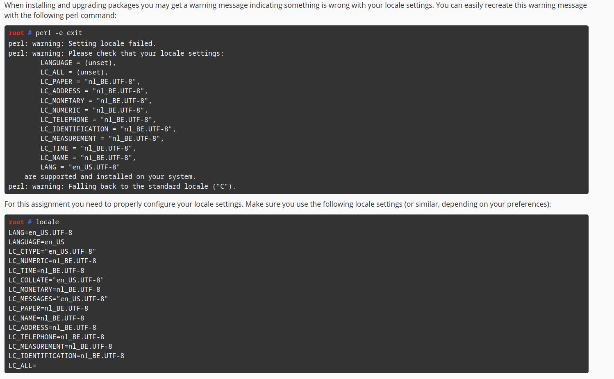

# SaSM Lab locale

## Important folders

## Assignments

    1. Configure the correct locale settings for your server.

    2. Document your progress in git. You do this for every step using descriptive commit messages. This will be used for evaluation purposes.

    3. Make sure an appropriate revision trail exists in git.

### 1. Configure the correct locale settings for your server.

Here's how you can set these specific locale settings on your server:

1. **Generate Locale**: Ensure that your system supports the `en_US.UTF-8` and `nl_BE.UTF-8` locales by generating them:

   ```bash
   sudo locale-gen en_US.UTF-8
   sudo locale-gen nl_BE.UTF-8
   ```

2. **Set Locale Variables**: Set the specific locale settings by adding them to the `/etc/default/locale` file. You can do this by editing the file with a text editor like `nano` or `vim`, or by using the command below:

   ```bash
   cat <<EOF | sudo tee /etc/default/locale
   LANG=en_US.UTF-8
   LANGUAGE=en_US
   LC_CTYPE="en_US.UTF-8"
   LC_NUMERIC=nl_BE.UTF-8
   LC_TIME=nl_BE.UTF-8
   LC_COLLATE="en_US.UTF-8"
   LC_MONETARY=nl_BE.UTF-8
   LC_MESSAGES="en_US.UTF-8"
   LC_PAPER=nl_BE.UTF-8
   LC_NAME=nl_BE.UTF-8
   LC_ADDRESS=nl_BE.UTF-8
   LC_TELEPHONE=nl_BE.UTF-8
   LC_MEASUREMENT=nl_BE.UTF-8
   LC_IDENTIFICATION=nl_BE.UTF-8
   EOF
   ```

3. **Apply Locale Settings**: For the changes to take effect, you might need to restart your system or at least some services depending on your specific setup.

4. **Verify**: After setting up, verify the changes by running `locale` or checking specific variables like `echo $LC_TIME`.

5. **Document in Git**:
   - Initialize a git repository (if not already done) using `git init`.
   - Track changes with `git add /etc/default/locale`.
   - Commit with a message, for example:
     ```bash
     git commit -m "Set system locale settings for internationalization support"
     ```
   - Make sure to push your changes to a remote repository to maintain the revision trail:
     ```bash
     git push origin main
     ```

And there you go! Your server should now be speaking in a mix of American English and Belgian Dutch. Need more tweaks or got stuck somewhere? Just shout! 🎙️✨

## Handy stuff


