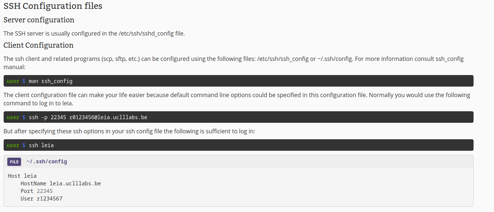

# SSH daemon configuration

## Important folders

    systemctl restart ssh.service

    /etc/ssh/sshd_config

    ~/.ssh/

    ~/.ssh/authorized_keys

    /etc/sshguard/sshguard.conf

## Assignments

Configure your ssh daemon to reflect the following specs:

    1. Listen to another port

    2. Disable dns reverse lookup

    3. Create user and allow him to log in with a public key

### 1. listen to another port

    Open "/etc/ssh/sshd_config" and set "Port" to your desired number. Like, Port 22345.
    it's sshD not ssh

### 2. Disable dns reverse lookup

    Open "/etc/ssh/sshd_config" and set "UseDns" to "no".

### 3. Create user and allow him to log in with public key

    1. Create a user: sudo adduser "username".

    2. Switch to the new user: sudo su - "username".

    3. Create .ssh directory: mkdir ~/.ssh && chmod 700 ~/.ssh.

    4. Create authorized_keys file: touch ~/.ssh/authorized_keys && chmod 600 ~/.ssh/authorized_keys.

    5. Add the public key to authorized_keys.

    6. Restart the SSH service: sudo service ssh restart.

# SSH bruteforce detection and mitigation

## Important folders

    /etc/ssh/sshd_config

    ~/.ssh/

    ~/.ssh/authorized_keys

    /etc/sshguard/sshguard.conf

## Assignments

    To set up SSHGuard for SSH brute force detection and mitigation, follow these steps:

### SSHGuard Installation and Configuration:

TODO: nog is te bekijken

1. **Install SSHGuard:**

   ```bash
   sudo apt-get update
   sudo apt-get install sshguard
   ```

2. **Configure SSHGuard:**
   SSHGuard monitors log files to detect brute force attacks. By default, it should monitor `/var/log/auth.log`. You can confirm or change this in its configuration file.

3. **Adjust SSHGuard Settings:**

   - **Edit the SSHGuard configuration file:**
     ```bash
     sudo nano /etc/sshguard/sshguard.conf
     ```
   - **Set the thresholds and block time:**
     - To block an IP after 5 failed attempts in 2 minutes, and ban it for 5 minutes, you might add or ensure the following lines exist:
       ```bash
       BLACKLIST_FILE=/var/lib/sshguard/blacklist.db
       THRESHOLD=50
       BLOCK_TIME=300
       DETECTION_TIME=120
       ```

4. **Restart SSHGuard to apply changes:**

   ```bash
   sudo systemctl restart sshguard
   ```

5. **Check SSHGuard Status:**
   ```bash
   sudo systemctl status sshguard
   ```

# Configure SSH tunnels

    SSH tunnels have many uses. Make sure you understand the ones explained in this section: SSH tunneling. Also make sure you know how to configure them.

https://wiki.uclllabs.be/index.php/SaSM_Lab_ssh_ssh_tunneling

## Handy stuff

ssh basics: https://wiki.uclllabs.be/index.php/SaSM_Lab_ssh_ssh_configuration

